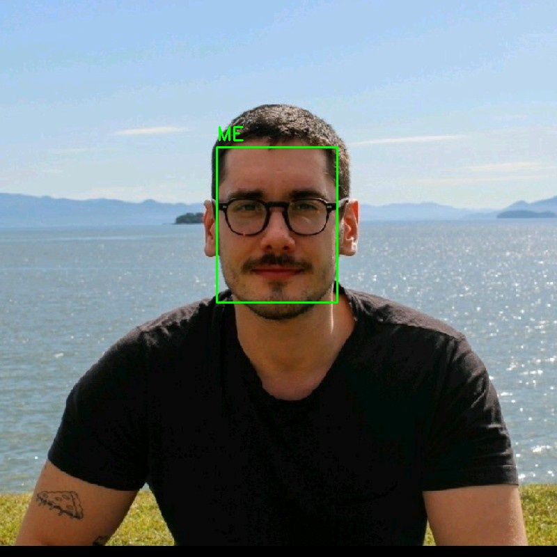
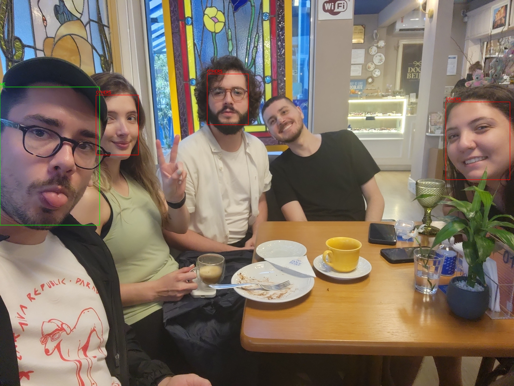
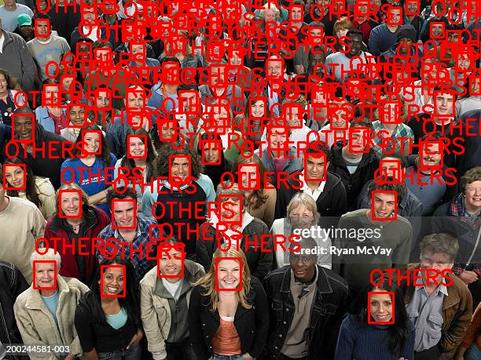

# Facial Recognition

This project is a machine learning challenge for facial recognition. The goal is to build a model that can recognize your face from images and videos. You can follow the steps to train the model on your own face or anyone else’s.

## Requirements

To get started, install the necessary dependencies using the following command:

```bash
  pip install -r requirements.txt
```

## Dataset Preparation

The model is trained with two classes: **ME** and **OTHERS**.

### 1. **OTHERS** Class
For the **OTHERS** class, I used the Open Images Dataset V6 (OIDv6), specifically the "Person" class. You can download the dataset by running:

```bash
  oidv6 downloader --dataset_path . --type train --classes Person
```

### 2. **ME** Class
For the **ME** class, you'll need images of yourself. I gathered these by using my phone’s facial recognition software to create an album of pictures of me. These images should be placed in the `my-pictures` folder.

### 3. **Processing Data**
Once the **OTHERS** class dataset is downloaded, and you have your personal images in the `my-pictures` folder, you can process the raw data into usable images for training by running:

```bash
  python3 process-data.py
```

After processing, you will have a `data` folder containing two subfolders: **me** and **others**. To optimize your training, you may want to manually check and remove any pictures of yourself that you don’t recognize.

> **Note:** The script was tested using both **MTCNN** and **cv2.CascadeClassifier** for face detection. **MTCNN** performed better for still images, **CascadeClassifier** produced more false positives.

## Training the Model

Once the dataset is ready, you can proceed to train the model. Run the following command:

```bash
  python3 train-model.py
```

This script uses **MobileNetV2** with transfer learning to create a binary classification model for facial recognition. The training includes data augmentation to enhance the model's robustness and is fine-tuned for both **ME** and **OTHERS** classes. After 10 epochs, the trained model is saved as `me-vs-others-model.keras`.

## Making Predictions

You can make predictions using the trained model on any new image. To test it, place images in the `test` folder (e.g., images of yourself, friends, and others) and run:

```bash
  python3 predict.py
```

The threshold for classifying an image as **ME** is set to **0.01**. This means that if the model's output is less than **0.01**, it will classify the image as **ME**; otherwise, it will classify it as **OTHERS**. This threshold provides high security for facial recognition (ranges from 0 to 1).

### Example Images:

- **ME:**



- **FRIENDS:**



- **OTHERS:**



## Live Prediction

For real-time facial recognition using your webcam, run the following command:

```bash
  python3 live-prediction.py
```

This script uses **CascadeClassifier** for live face detection and labeling. It performed better on live video streams. The threshold for classification is set to **0.15**, which is considered moderate security and can be used for access control purposes.

### Live Prediction Example:


---

By following these steps, you can train a facial recognition model for personal use or extend it for other applications such as access control, surveillance, or custom recognition tasks.

